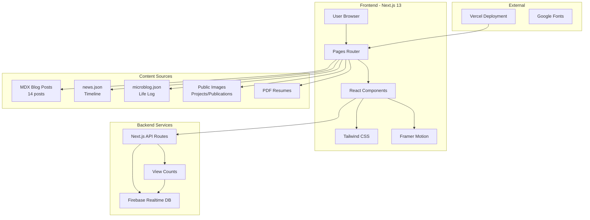
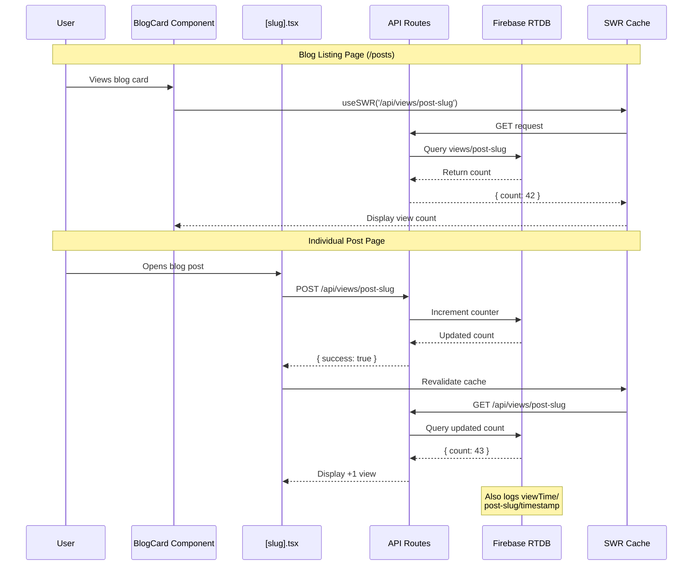
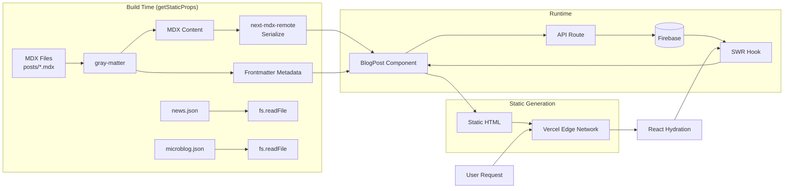
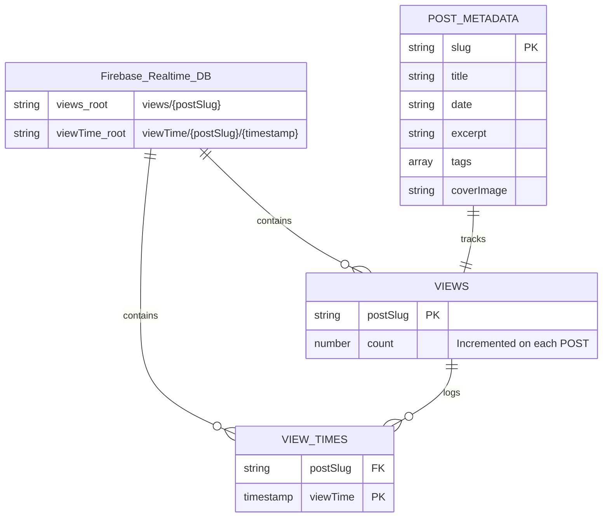
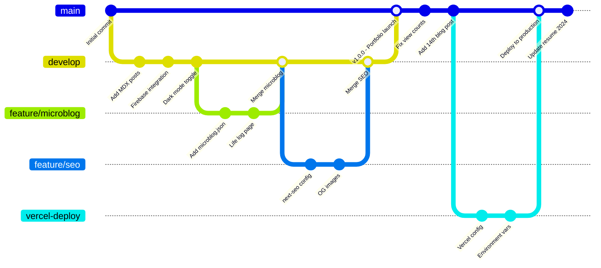
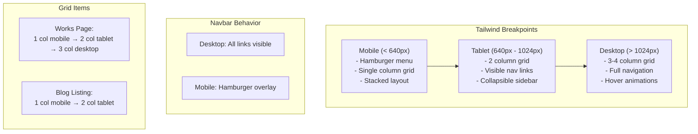
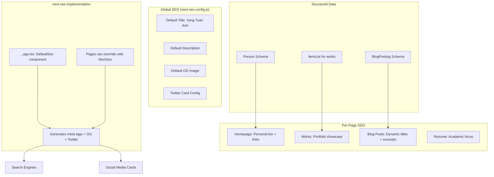
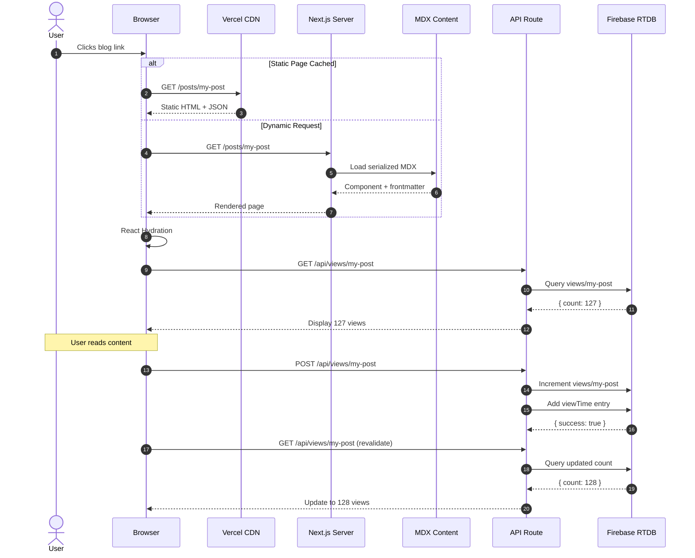

# PersonaJP — Personal Portfolio & Blog

**Live site:** [https://www.yangtuananh.dev](https://www.yangtuananh.dev)  
**License:** GNU AGPL v3

---

## Overview

PersonaJP is the personal portfolio website of **Yang Tuan Anh**, a Vietnamese-Taiwanese Computer Science student and researcher. It serves as a central hub showcasing projects, publications, a blog, a microblog (life log), a resume/CV, and a news/timeline feed.

---

## Tech Stack

| Category         | Technologies                                                        |
| ---------------- | ------------------------------------------------------------------- |
| Framework        | Next.js 13.1.1 (Pages Router), React 18.2.0                        |
| Language         | TypeScript 4.9.4                                                    |
| Styling          | Tailwind CSS 3.2.4, PostCSS, Autoprefixer                          |
| Fonts            | Manrope (Google Fonts), Inter (@next/font)                          |
| Blog / Content   | MDX via `next-mdx-remote`, `gray-matter` for frontmatter parsing    |
| Animations       | Framer Motion 8.x                                                   |
| Icons            | react-icons (Feather, Font Awesome)                                 |
| Dark Mode        | next-themes (class-based)                                           |
| SEO              | next-seo                                                             |
| Data Fetching    | SWR (stale-while-revalidate)                                        |
| Database         | Firebase Realtime Database (Admin SDK + Client SDK)                 |
| API              | Next.js API routes (serverless functions)                           |
| Linting          | ESLint (next/core-web-vitals)                                       |
| Package Manager  | Yarn                                                                 |
| Deployment       | Vercel                                                               |

---

## Project Structure

```
PersonaJP/
├── pages/                    # Next.js Pages Router
│   ├── _app.tsx              # App wrapper (ThemeProvider, Layout, AnimatePresence, DefaultSeo)
│   ├── _document.tsx         # Custom Document (Manrope font, lang="en")
│   ├── index.tsx             # Homepage — banner, bio timeline, interests, social links
│   ├── works.tsx             # Portfolio grid — projects, collaborations, publications, old works
│   ├── resume.tsx            # Embedded PDF viewer with download button
│   ├── news.tsx              # Chronological news timeline (data/news.json)
│   ├── microblog.tsx         # Life log (data/microblog.json)
│   ├── panels.tsx            # Interactive expandable-panel UI demo
│   ├── 404.tsx               # Custom 404 page
│   ├── posts/
│   │   ├── index.tsx         # Blog listing (SSG — getStaticProps)
│   │   └── [slug].tsx        # Individual blog post (SSG + dynamic routes)
│   └── api/views/
│       └── [slug].ts         # API route — GET/POST view counts via Firebase
│
├── components/
│   ├── layouts/main.tsx      # Navbar + content + Footer
│   ├── Navbar/index.tsx      # Responsive navbar (hamburger menu, active-link highlighting)
│   ├── Footer/index.tsx      # Footer with dynamic year
│   ├── Logo/index.tsx        # Waffle logo + name link
│   ├── DarkMode/index.tsx    # Light/dark theme toggle
│   ├── Section/section.tsx   # Framer Motion animated section wrapper
│   ├── GridItems/index.tsx   # Portfolio card (image, title, desc, hover effects)
│   ├── Blog/BlogCard/        # Blog listing card with view count (SWR)
│   ├── StyledLink/           # Teal-colored external link component
│   └── SocialMediaLink/      # Pink-colored social link component
│
├── data/
│   ├── posts/                # 14 MDX blog posts with frontmatter
│   ├── news.json             # Structured news/timeline entries
│   └── microblog.json        # Structured life-log entries
│
├── lib/
│   └── firebase.ts           # Firebase Admin SDK initialization (server-side)
│
├── public/
│   ├── images/
│   │   ├── profile.jpeg, banner.png, waffle_logo.png
│   │   ├── posts/            # Blog post images
│   │   └── works/
│   │       ├── projects/     # 30+ project thumbnails
│   │       └── publications/ # 11 publication thumbnails
│   ├── *.pdf                 # Resume / CV PDFs (2023, 2024, Academic)
│   └── *.svg, favicon.ico
│
├── styles/
│   └── globals.css           # Tailwind layers + base typography
│
├── Configuration files:
│   ├── package.json          # Dependencies & scripts
│   ├── tsconfig.json         # TypeScript config (strict mode)
│   ├── tailwind.config.js    # Custom colors, dark mode 'class'
│   ├── next.config.js        # React strict mode, Unsplash image domain
│   ├── next-seo.config.js    # Global SEO defaults
│   ├── postcss.config.js     # Tailwind + Autoprefixer
│   ├── .eslintrc.json        # Next.js core-web-vitals
│   ├── .env                  # Firebase credentials
│   └── .gitignore
│
├── LICENSE
└── README.md
```

---

## Key Features

### 1. Portfolio / Works
A grid-based showcase organized into four categories: **Projects** (30+), **Collaborations**, **Publications** (10+), and **Old Works**. Each card displays a thumbnail image, title, and description with hover effects via Framer Motion.

### 2. Blog (MDX)
14 blog posts in MDX format with frontmatter metadata. Posts cover study techniques, Chinese language learning, thesis advice, generative art, competitive programming, and personal essays. Each post tracks view counts via Firebase.

**View-count data flow:**
1. On mount, `[slug].tsx` calls `POST /api/views/[slug]`
2. API route increments a counter in Firebase Realtime Database
3. `BlogCard` and post pages fetch view counts via SWR from `GET /api/views/[slug]`
4. View timestamps are logged under `viewTime/[slug]/` in Firebase

### 3. News / Timeline
A chronological feed of major life, academic, and career milestones from 2021 to present, rendered from `data/news.json`.

### 4. Microblog (Life Log)
A daily-ish personal journal since 2023 covering personal events, fitness progress, contests, and social activities, rendered from `data/microblog.json`.

### 5. Resume / CV
Embedded PDF viewer with a download button, supporting multiple PDF versions (2023, 2024, Academic).

### 6. Dark Mode
Full dark mode support via `next-themes` (class-based) with animated toggle between light and dark themes.

### 7. SEO
Global SEO defaults configured via `next-seo.config.js`, including a default Open Graph image.

---

## Scripts

| Command          | Description                     |
| ---------------- | ------------------------------- |
| `yarn dev`       | Start development server        |
| `yarn build`     | Production build                |
| `yarn start`     | Start production server         |
| `yarn lint`      | Run ESLint                      |

---

## Environment Variables

Defined in `.env` (NOTE: currently committed to the repo):

| Variable                          | Description                          |
| --------------------------------- | ------------------------------------ |
| `FIREBASE_PRIVATE_KEY`            | Firebase Admin SDK private key       |
| `FIREBASE_CLIENT_EMAIL`           | Firebase service account email       |
| `NEXT_PUBLIC_FIREBASE_PROJECT_ID` | Firebase project ID                  |
| `FIREBASE_DATABASE_URL`           | Firebase Realtime Database URL       |

---

## Security Note

The `.env` file containing Firebase credentials is **committed to the repository**. The `.gitignore` only ignores `.env*.local` files — the base `.env` should ideally be added to `.gitignore` and a `.env.example` template used instead.

---

## Deployment

Deployed on **Vercel**. The `next.config.js` includes Vercel-specific optimizations. No Docker, CI/CD pipeline, or test suite is configured.

---

## Architecture Diagrams

### 1. Complete Architecture Overview



### 2. Blog System & View Count Flow



### 3. Data Flow & Content Pipeline



### 4. Component Hierarchy

```mermaid
graph TD
    App[_app.tsx<br/>ThemeProvider + Layout]

    App --> Layout[main.tsx Layout]
    Layout --> Navbar[Navbar<br/>Responsive + Hamburger]
    Layout --> Content[Page Content]
    Layout --> Footer[Footer<br/>Dynamic Year]

    Navbar --> Logo[Logo<br/>Waffle + Name]
    Navbar --> DarkMode[DarkMode Toggle]
    Navbar --> NavLinks[Navigation Links<br/>Works, Blog, Resume, News]

    Content --> Index[index.tsx Homepage]
    Content --> Works[works.tsx Portfolio]
    Content --> Posts[posts/index.tsx Blog]
    Content --> PostPage[posts/[slug].tsx]
    Content --> Resume[resume.tsx PDF]
    Content --> News[news.tsx Timeline]
    Content --> Micro[microblog.tsx]

    Works --> GridItems[GridItems<br/>Portfolio Cards]
    GridItems --> Category[4 Categories:<br/>Projects, Collaborations,<br/>Publications, Old Works]

    Posts --> BlogCard[BlogCard<br/>+ SWR View Count]
    PostPage --> MDXRenderer[MDX Renderer]
    PostPage --> ViewCounter[View Counter]

    News --> JSON[news.json]
    Micro --> JSON2[microblog.json]
```

### 5. Dark Mode Implementation

```mermaid
graph LR
    subgraph "Theme System"
        User[User Click] --> Toggle[DarkMode Component]
        Toggle --> NextThemes[next-themes]

        NextThemes --> SetTheme[setTheme('dark'/'light')]
        SetTheme --> Class[Add/Remove 'dark' class<br/>to html element]

        Class --> Tailwind[Tailwind CSS<br/>dark: variant]
        Tailwind --> LightStyles[Light Mode Styles]
        Tailwind --> DarkStyles[Dark Mode Styles]
    end

    subgraph "Persistence"
        Class --> Storage[localStorage]
        Storage --> NextLoad[Next.js Load]
        NextLoad --> Detect[Detect stored theme]
        Detect --> Apply[Apply before paint]
    end

    subgraph "Components"
        LightStyles --> NavbarDark[Navbar dark styles]
        LightStyles --> CardsDark[Card dark styles]
        LightStyles --> TextDark[Text dark styles]

        DarkStyles --> NavbarLight[Navbar light styles]
        DarkStyles --> CardsLight[Card light styles]
        DarkStyles --> TextLight[Text light styles]
    end
```

### 6. Page Routing Structure

```mermaid
graph TD
    Root[/] --> Index[index.tsx<br/>Homepage]

    Root --> Works[/works]
    Works --> Projects[Projects]
    Works --> Collaborations[Collaborations]
    Works --> Publications[Publications]
    Works --> OldWorks[Old Works]

    Root --> Blog[/posts]
    Blog --> Post1[/posts/slug-1<br/>MDX + View Count]
    Blog --> Post2[/posts/slug-2<br/>MDX + View Count]
    Blog --> PostN[/posts/slug-n<br/>14 total posts]

    Root --> Resume[/resume<br/>PDF Viewer]
    Resume --> PDF2023[Resume 2023.pdf]
    Resume --> PDF2024[Resume 2024.pdf]
    Resume --> PDFAcademic[Academic CV.pdf]

    Root --> News[/news<br/>Timeline]
    News --> NewsData[news.json]

    Root --> Micro[/microblog<br/>Life Log]
    Micro --> MicroData[microblog.json]

    Root --> Panels[/panels<br/>Interactive Demo]

    Root --> API[/api/views/[slug]]
    API --> GET[GET - Fetch count]
    API --> POST[POST - Increment]

    Root --> 404[404.tsx<br/>Custom Not Found]
```

### 7. Firebase Data Schema



### 8. Build & Deployment Pipeline



### 9. Responsive Design Breakpoints



### 10. SEO & Metadata Strategy



### Bonus: Complete Blog Post Request Flow


